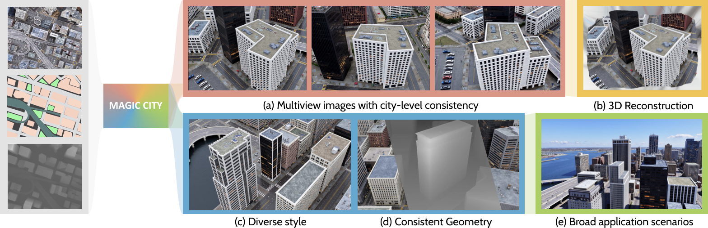
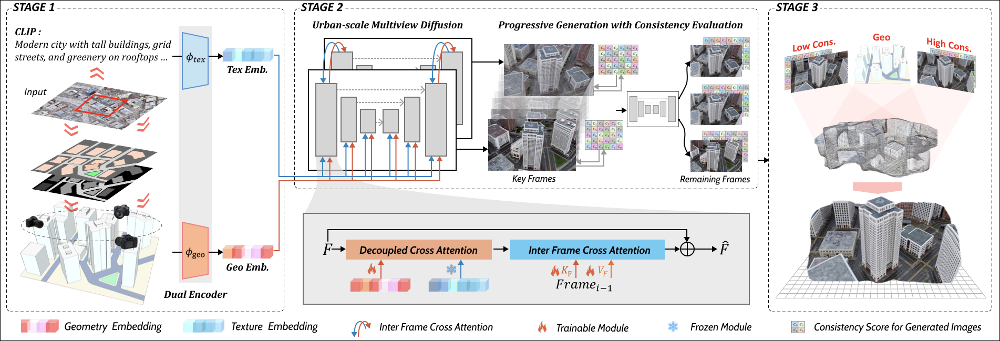

## [ICCV2025] MagicCity: Geometry-Aware 3D City Generation from Satellite Imagery with Multi-View Consistency

This is the project page of MagicCity: Geometry-Aware 3D City Generation from Satellite Imagery with Multi-View Consistency.

### Cover

### Abstract
MagicCity is a geometry-aware 3D city generation framework that leverages multi-view consistency to reconstruct large-scale urban scenes from satellite imagery. By conditioning on geometric priors and enforcing view/depth consistency during training, our method achieves strong structural fidelity and cross-view coherence, enabling realistic city-scale reconstruction and visualization.

### Pipeline

### Pipeline Notes
(a) Given a satellite image as input, we first predict its texture descriptors and 3D structure
from depth/segmentation maps and then encode these features through our Dual Encoder. 

(b) These encoded features are injected into the City-scale Multi-view Diffusion model to generate photorealistic multi-view images with city-scale structural consistency. Subsequently, we evaluate consistency scores across generated images. 

(c) Finally, the generated multi-view images are fed into a robust 3D Gaussian Splatting pipeline, where instance-level consistency scores guide the color initialization and adaptive optimization of 3D Gaussian points across views.

### Results
<video src="results_1.mp4" controls preload="metadata" width="500"></video>

### Todo List
- **dataset preparation instruction**
- **code for generate multiview images, reconstruction and training**

